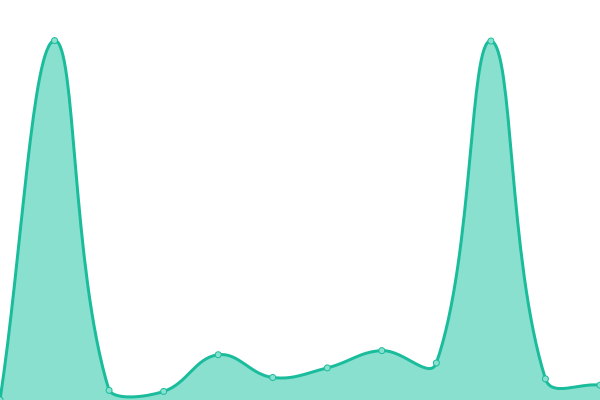
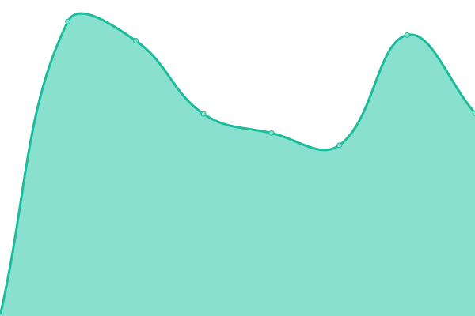
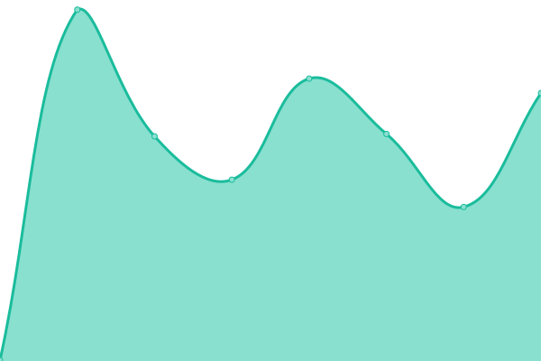

# [📈 Live Status](https://gammarinaldi.github.io/watcher): <!--live status--> **🟧 Partial outage**

This repository contains the open-source uptime monitor and status page for [Gama Rinaldi](https://www.linkedin.com/in/gamma-rinaldi-a0344872/), powered by [Upptime](https://github.com/upptime/upptime).

With [Upptime](https://upptime.js.org), you can get your own unlimited and free uptime monitor and status page, powered entirely by a GitHub repository. We use [Issues](https://github.com/gammarinaldi/watcher/issues) as incident reports, [Actions](https://github.com/gammarinaldi/watcher/actions) as uptime monitors, and [Pages](https://gammarinaldi.github.io/watcher) for the status page.

<!--start: status pages-->
<!-- This summary is generated by Upptime (https://github.com/upptime/upptime) -->
<!-- Do not edit this manually, your changes will be overwritten -->
<!-- prettier-ignore -->
| URL | Status | History | Response Time | Uptime |
| --- | ------ | ------- | ------------- | ------ |
|  [Pintu](https://pintu.co.id) | 🟩 Up | [pintu.yml](https://github.com/gammarinaldi/watcher/commits/HEAD/history/pintu.yml) | 

 421ms
     
 | 

<a href="https://gammarinaldi.github.io/watcher/history/pintu">100.00%</a>
    

|  [Tokocrypto](https://tokocrypto.com) | 🟥 Down | [tokocrypto.yml](https://github.com/gammarinaldi/watcher/commits/HEAD/history/tokocrypto.yml) | 

 160ms
     
 | 

<a href="https://gammarinaldi.github.io/watcher/history/tokocrypto">100.00%</a>
    

|  [Indodax](https://indodax.com) | 🟩 Up | [indodax.yml](https://github.com/gammarinaldi/watcher/commits/HEAD/history/indodax.yml) | 

 1280ms
     
 | 

<a href="https://gammarinaldi.github.io/watcher/history/indodax">100.00%</a>
    

|  [Stockbit](https://stockbit.com) | 🟩 Up | [stockbit.yml](https://github.com/gammarinaldi/watcher/commits/HEAD/history/stockbit.yml) | 

 893ms
     
 | 

<a href="https://gammarinaldi.github.io/watcher/history/stockbit">100.00%</a>
    

<!--end: status pages-->

[**Visit our status website →**](https://gammarinaldi.github.io/watcher)

## 📄 License

- Powered by: [Upptime](https://github.com/upptime/upptime)
- Code: [MIT](./LICENSE) © [Gama Rinaldi](https://www.linkedin.com/in/gamma-rinaldi-a0344872/)
- Data in the `./history` directory: [Open Database License](https://opendatacommons.org/licenses/odbl/1-0/)
